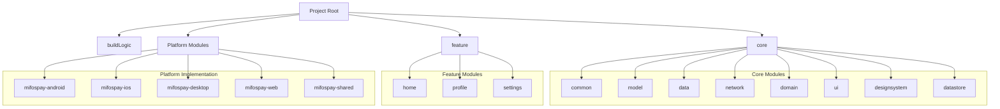

# KMP Multi-Module Project Generator

## Overview
The Kotlin Multiplatform Multi-module Template generator enables the development of cross-platform applications,
supporting Android, iOS, Desktop, and Web. It allows for the sharing of business logic and UI components across these platforms
while preserving native platform features and capabilities.

## Project Structure

### Core Modules
- **buildLogic/**: Contains shared Gradle build configurations and custom plugins
- **core/**: Contains the main business logic modules
   - `analytics`: Analytics and logging utilities
   - `common`: Shared code across all platforms
   - `model`: Data models and structures
   - `data`: Data layer implementation
   - `network`: Network communication and API clients
   - `domain`: Business logic and use cases
   - `ui`: Shared UI components using Compose Multiplatform
   - `designsystem`: App-wide design system components
   - `datastore`: Local data storage implementation

### Feature Modules
- **feature/**: Contains feature-specific modules
   - `home`: Home screen and related functionality
   - `profile`: User profile management
   - `settings`: Application settings

### Platform-Specific Modules
- **mifospay-android/**: Android application implementation
- **mifospay-ios/**: iOS application implementation
- **mifospay-desktop/**: Desktop application implementation
- **mifospay-web/**: Web application implementation
- **mifospay-shared/**: Shared Kotlin Multiplatform code

## Project Customization Script

### Overview
The project includes a bash script (`customizer.sh`) that helps in customizing the project for different implementations. This script automates the process of renaming packages, updating configurations, and maintaining consistency across the project structure.

### Prerequisites
- Bash version 4 or higher
- Unix-like environment (macOS, Linux)

### Usage

```bash
bash customizer.sh <package-name> <project-name> [application-name]
```

#### Parameters
- `package-name`: New package name (e.g., com.example.myapp)
- `project-name`: New project name
- `application-name`: (Optional) Custom application name (defaults to project-name)

#### Example
```bash
bash customizer.sh com.example.myapp MyKMPApp
```

## License and Copyright Updates

### Updating License and Copyright Information

After running the customizer script to change package names and project structure, you'll need to update the license and copyright information across the project. This process involves:

1. **Locate License Files**
    - Navigate to the `spotless` directory
    - Find the license header templates
    - Update the copyright year and organization information
<br/><br/>  
2. **Apply Changes**
    - Run the Spotless plugin to update all files:
      ```bash
      ./gradlew spotlessApply
      ```
    - This will automatically update the license headers in all source files
    - Verify the changes in a few files to ensure correct application

### Script Features

#### 1. Package Updates
- Updates base package name across all modules
- Modifies Compose Resources configuration
- Updates Android Manifest package name
- Handles iOS bundle identifier updates

#### 2. Project Naming
- Renames project-wide references
- Updates application class names
- Maintains consistency in capitalization and naming conventions

#### 3. Module Management
- Renames modules with new project prefix
- Updates module references in Gradle files
- Maintains correct module dependencies
- Updates import statements across the project

#### 4. Configuration Updates
- Updates convention plugin IDs
- Modifies run configurations
- Updates build settings
- Handles iOS-specific configurations

#### 5. Code Updates
- Renames files with project-specific prefixes
- Updates package declarations and imports
- Maintains typesafe accessors for Gradle

### Important Notes

1. **Backup**: The script creates backup files during execution (*.bak) and cleans them up after successful completion
2. **Error Handling**: The script uses `set -e` to stop execution on any error
3. **Platform Support**: Handles configurations for all supported platforms (Android, iOS, Desktop, Web)
4. **Directory Structure**: Maintains the KMP project structure while updating references

### Best Practices

1. **Before Running the Script**
   - Create a backup of your project
   - Ensure you have the correct permissions
   - Verify bash version compatibility

2. **After Running the Script**
   - Verify the changes in your IDE
   - Run a test build for each platform
   - Check if all module references are correctly updated

3. **Common Issues**
   - Package name formatting
   - Module dependency resolution
   - Platform-specific configuration updates

## Development Guidelines

### Adding New Features
1. Create a new feature module in the `feature/` directory
2. Follow the existing module structure
3. Use shared components from `core/` modules
4. Implement platform-specific code in respective modules

### Shared Code Guidelines
1. Use `expect/actual` declarations for platform-specific implementations
2. Leverage Compose Multiplatform for UI components
3. Keep business logic in shared modules
4. Use KMP-compatible dependencies

### Building and Running
1. Use appropriate run configurations for each platform
2. Ensure all required SDKs are installed
3. Follow platform-specific build instructions

### Project Structure


## Contributing
1. Follow the project's coding standards
2. Write tests for new features
3. Document changes and additions
4. Submit pull requests with clear descriptions

## Troubleshooting
1. Check build logs for errors
2. Verify module dependencies
3. Ensure correct SDK versions
4. Check platform-specific configurations