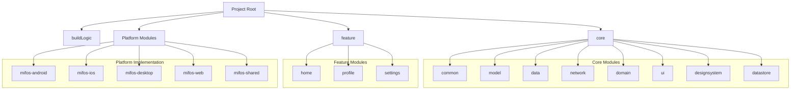

<div align="center">
    
    <div align="center">
      <h1>KMP Multi-Module Project Generator</h1>
      <p>
        🚀 Kickstart your Kotlin Multiplatform project with a fully-configured multi-module setup within minutes.
      </p>
    </div> 

</div>

<div align="center">


[](http://makeapullrequest.com)
[](https://github.com/openMF/kmp-project-template/blob/development/LICENSE)
[](https://github.com/openMF/kmp-project-template/releases/)
[](https://github.com/openMF/kmp-project-template/issues/)
[](https://github.com/openMF/kmp-project-template/actions/workflows/pr-check.yml)
[](https://join.slack.com/t/mifos/shared_invite/zt-2wvi9t82t-DuSBdqdQVOY9fsqsLjkKPA)
[](https://mifosforge.jira.com/jira/software/c/projects/MM/issues/?filter=allissues&jql=project%20%3D%20%22MM%22%20ORDER%20BY%20created%20DESC)

</div>

> \[!Note]
>
> This branch is designed for fully customized projects. Running the customizer.sh script will rename all application module prefixes (e.g., mifos-) with your project name and update the namespaces, packages, and other related configurations accordingly.
>
> For partial customization, please use the `dev` branch instead.

> **For Example:**
>
> If your project name is myproject, the script will:
> - Rename modules like mifos-android to myproject-android, mifos-desktop to myproject-desktop, etc.
> - Update the package structure, such as org.mifos to org.myproject, etc
> - Adjust namespaces in the codebase to align with your project name.

## Overview

The Kotlin Multiplatform Multi-module Project generator simplifies the development of cross-platform
applications for Android, iOS, Desktop(JVM), and Web.

Unlike other **wizards** that only generate a basic **Kotlin Multiplatform (KMP) or Compose
Multiplatform (CMP) library**
and require users to configure their projects manually—a challenging and time-consuming process.

This generator streamlines the setup. By simply running the `customizer.sh` bash script
with your desired **package and project name**, the template generates an **entire, fully-configured
project within a minutes**.

The resulting project is ready to **run seamlessly across multiple platforms**, combining shared
business logic and UI components with native platform capabilities.

This template goes beyond the basics, offering a production-ready setup out of the box. It includes:

- **Multi-module Structure:** Organized core, feature, and platform-specific modules for easy
  development.
- **Shared UI Components:** Compose Multiplatform for shared UI components across platforms.
- **Dependency Management:** Gradle Kotlin DSL for dependency management and build scripts.
- **Static Analysis Tools:** Pre-configured Detekt and Spotless for code quality and style
  consistency.
- **Git Hooks:** Automated checks to ensure high-quality commits.
- **CI/CD Workflows:** GitHub Actions for KMP build and publish pipelines, complete with PR checks.
- **Fastlane**: Automated deployment and release management for Android and iOS platforms.
- **Run configurations:** for Android, iOS, Desktop, and Web platforms.
- **Dynamic Versioning:** Automatic versioning and release notes generation for each platform.

The generated project is ready to run seamlessly across multiple platforms, combining shared
business logic and UI components with native platform capabilities.

### Project Customization Script

The project includes a bash script (`customizer.sh`) that helps in customizing the project for
different implementations. This script automates the process of renaming packages, updating
configurations, and maintaining consistency across the project structure.

### Prerequisites

- Bash version 4 or higher
- Unix-like environment (macOS, Linux) or Git Bash on Windows

### Usage

1. **Download the project:** Clone or download the repository to your local machine.

    ```bash
    git clone <repository-url>
    cd <project-folder>
    ```

    2. **Run the setup script:** Execute the customizer.sh script with your desired package and
       project name.

        ```bash
        ./customizer.sh <package-name> <project-name> [application-name]
        ```
       Example:

       ```bash
       ./customizer.sh org.delta MyKMPApp
       ```

3. **Generated project:** The script will generate a fully-configured, multi-module KMP project in
   just 2 minutes.

4. **Run and develop:** Open the project in your favorite IDE (e.g., IntelliJ IDEA), and start
   building your cross-platform application.

#### Parameters

- `package-name`: New package name (e.g., com.example.myapp)
- `project-name`: New project name
- `application-name`: (Optional) Custom application name (defaults to project-name)

With this setup, you’re ready to develop and deploy your application on Android, iOS, Desktop, and
Web with ease!

#### Example

```bash
bash customizer.sh com.example.myapp MyKMPApp
```

### Updating License and Copyright Information

After running the customizer script to change package names and project structure, you'll need to
update the license and copyright information across the project. This process involves:

1. **Locate License Files**
    - Navigate to the `spotless` directory
    - Find the license header templates
    - Update the copyright year and organization information
      <br/><br/>
2. **Apply Changes**
    - Run the Spotless plugin to update all files:
      ```bash
      ./gradlew spotlessApply
      ```
    - This will automatically update the license headers in all source files
    - Verify the changes in a few files to ensure correct application

### Adding New Features

1. Create a new feature module in the `feature/` directory
2. Follow the existing module structure
3. Use shared components from `core/` modules
4. Implement platform-specific code in respective modules

### Shared Code Guidelines

1. Use `expect/actual` declarations for platform-specific implementations
2. Leverage Compose Multiplatform for UI components
3. Keep business logic in shared modules
4. Use KMP-compatible dependencies

### Building and Running

1. Use appropriate run configurations for each platform
2. Ensure all required SDKs are installed
3. Follow platform-specific build instructions

### Project Structure

### Core Modules

- **buildLogic/**: Contains shared Gradle build configurations and custom plugins
- **core/**: Contains the main business logic modules
    - `analytics`: Analytics and logging utilities
    - `common`: Shared code across all platforms
    - `model`: Data models and structures
    - `data`: Data layer implementation
    - `network`: Network communication and API clients
    - `domain`: Business logic and use cases
    - `ui`: Shared UI components using Compose Multiplatform
    - `designsystem`: App-wide design system components
    - `datastore`: Local data storage implementation

### Feature Modules

- **feature/**: Contains feature-specific modules
    - `home`: Home screen and related functionality
    - `profile`: User profile management
    - `settings`: Application settings

### Platform-Specific Modules

- **mifos-android/**: Android application implementation
- **mifos-ios/**: iOS application implementation
- **mifos-desktop/**: Desktop application implementation
- **mifos-web/**: Web application implementation
- **mifos-shared/**: Shared Kotlin Multiplatform code

### Project Modules



### Contributing

1. Follow the project's coding standards
2. Write tests for new features
3. Document changes and additions
4. Submit pull requests with clear descriptions

### Troubleshooting

1. Check build logs for errors
2. Verify module dependencies
3. Ensure correct SDK versions
4. Check platform-specific configurations