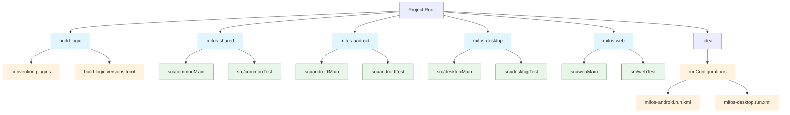
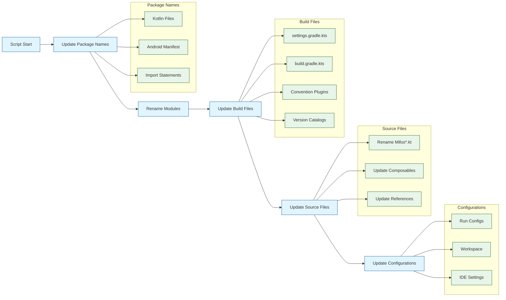

# KMP Multi-Module Project Generator

A bash script to customize and rename Kotlin Multiplatform projects. This tool helps you quickly adapt the template project structure with your own package name and project settings.

## Features

- Renames all modules with your project name
- Updates package names throughout the codebase
- Handles Kotlin Multiplatform specific source sets
- Updates Gradle build files and settings
- Renames files and composable functions
- Updates run configurations
- Handles convention plugins
- Updates import statements
- Preserves project structure and functionality

## Prerequisites

- Bash version 4 or higher
- Unix-like environment (Linux/macOS)
- For macOS users: You may need to install a newer version of bash using Homebrew:
  ```bash
  brew install bash
  ```

## Usage

1. Copy the `customizer.sh` script to your project root directory
2. Make it executable:
   ```bash
   chmod +x customizer.sh
   ```
3. Run the script with your desired package name and project name:
   ```bash
   ./customizer.sh com.example.myapp MyProject
   ```

### Parameters

- `package_name`: Your desired package name (e.g., com.example.myapp)
- `project_name`: Your project name in PascalCase (e.g., MyProject)
- `application_name`: (Optional) Custom application class name

### Example

```bash
./customizer.sh com.company.awesomeapp AwesomeApp
```

This will:
1. Rename all modules from `mifos-*` to `awesomeapp-*`
2. Update package from `org.mifos` to `com.company.awesomeapp`
3. Rename files like `MifosApp.kt` to `AwesomeApp.kt`
4. Update all relevant configurations and references

## What Gets Updated

1. **Module Names**
    - `mifos-shared` → `yourproject-shared`
    - `mifos-android` → `yourproject-android`
    - `mifos-desktop` → `yourproject-desktop`
    - `mifos-web` → `yourproject-web`

2. **Package Names**
    - Updates all package declarations
    - Updates all import statements
    - Updates AndroidManifest.xml

3. **Build Files**
    - settings.gradle.kts
    - build.gradle.kts files
    - Convention plugins
    - Version catalog entries

4. **Run Configurations**
    - Updates configuration names
    - Updates module references
    - Renames configuration files

5. **Source Files**
    - Renames files with "Mifos" prefix
    - Updates composable function names
    - Updates class names and references

## Project Structure


## File Modified By Script
